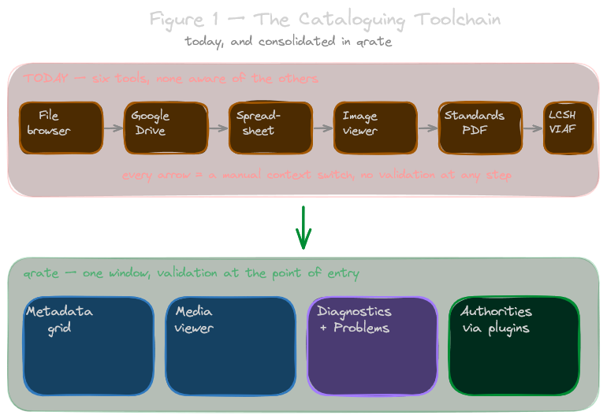
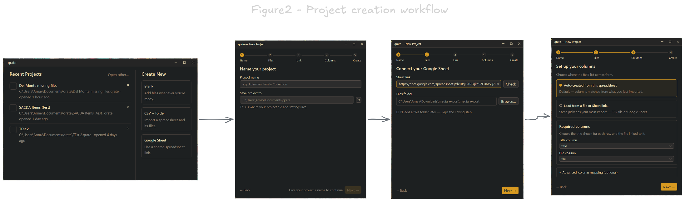
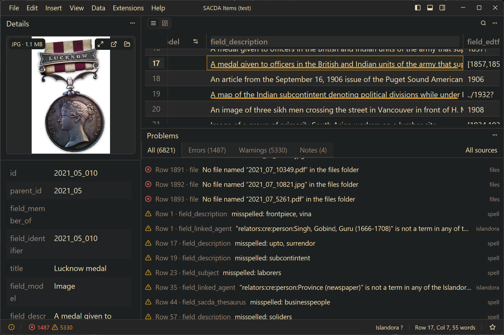
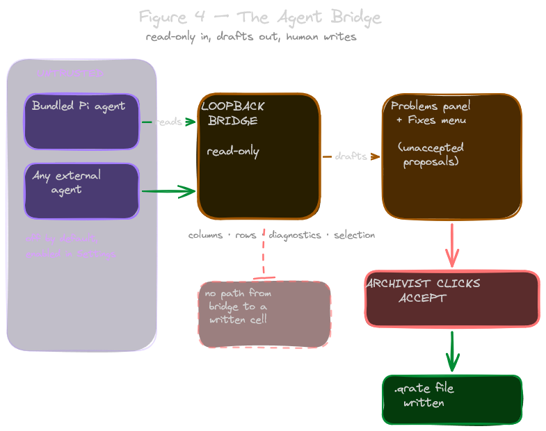
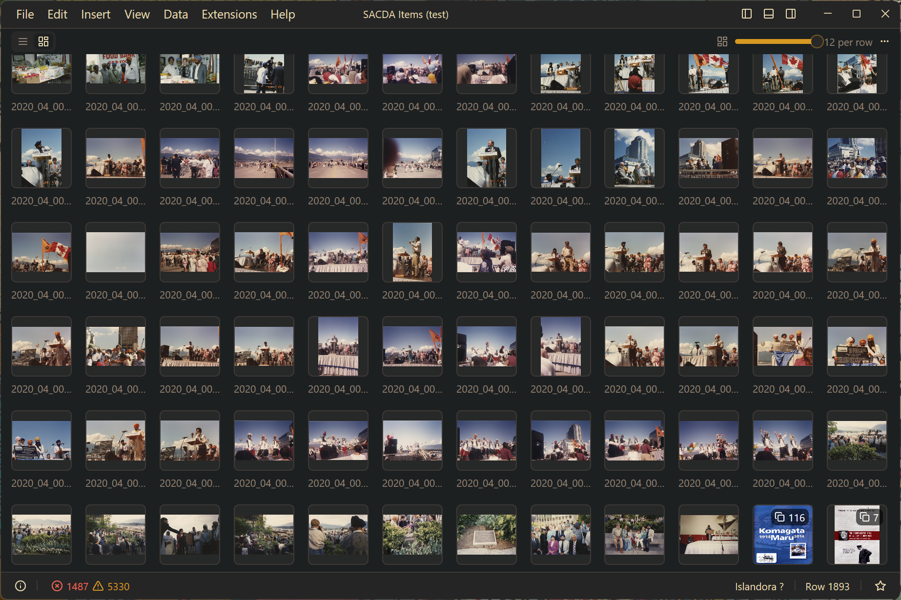

# qrate

  

**A desktop catalog for collections that need to stay useful, portable, and under your control.**

qrate helps archives, libraries, museums, researchers, and small collection teams describe and care for collections without giving up their data to a hosted system. Work in a familiar spreadsheet-style grid, connect records to the files they describe, find problems before they spread, and export your catalog when it is time to share or move it.

[Download qrate](https://github.com/devnull03/qrate/releases) · [Read the user guide](docs/index.md) · [Contribute](CONTRIBUTING.md)

> **Early release:** qrate is currently `0.4.0-beta.2`. Keep backups of important collections and report reproducible problems in an issue.

## Why qrate

Collection data rarely lives in just one place. A spreadsheet names an object, a folder holds its images or scans, and a receiving system asks for a different export format. qrate brings that everyday work together while keeping the catalog as a portable project file you can retain and move.

- **Keep ownership of your work.** Each project is a portable `.qrate` SQLite file; linked media remains where you keep it. qrate does not require an account or a hosted service.
- **Describe collections with less friction.** Create a project, import a CSV and its folder, or start from a Google Sheet. Edit, search, filter, copy and paste, undo changes, and tailor columns to the collection.
- **See the records and the material together.** Link by filename or a pattern, browse a gallery of thumbnails, and preview images, documents, audio, and video alongside each record.
- **Catch problems while you work.** Check spelling, date formats, file links, headings, and selected authority sources. Review a proposed whole-cell correction before applying it.
- **Take your data where it needs to go.** Export CSV, JSON-LD, CSL-JSON, or a ZIP archive. Google Sheets export and sync are available when you choose to enable them.
- **Use AI with a human in control.** An optional local agent can review the open project and stage findings in the Problems panel. It cannot change a cell; you decide what to accept.

## A typical workflow

1. Create a blank project or bring in an existing CSV or Google Sheet.
2. Describe and organize records in the grid; configure the fields that matter to your collection.
3. Link supporting photos, scans, recordings, or video, then inspect them from the record.
4. Use the Problems panel to review data-quality checks and proposed corrections.
5. Export a clean catalog in the format your next system or collaborator needs.

## See qrate at work

*Review a collection record, its linked media, and every problem found across the project in one workspace.*

*Optional AI review is advisory: it stages findings for the archivist to accept or reject.*

*Browse large linked-media collections in a thumbnail gallery without losing sight of data quality.*

## Get qrate

Download the installer or portable build for your platform from [GitHub Releases](https://github.com/devnull03/qrate/releases). Release assets are available for Windows, macOS, and Linux. Releases are currently unsigned, so Windows SmartScreen or macOS Gatekeeper may ask for confirmation the first time you open qrate.

PDF preview support is included in release builds. For video previews and some less-common image formats, install `ffmpeg` and make it available on your system `PATH`.

## Your data and privacy

A `.qrate` file stores the collection grid, settings, notes, and project metadata. Linked media is not copied into it, so you remain in charge of where those files live.

qrate works without an account. Google Sheets integration is off until you enable it in **Settings ▸ Google**; sign-in happens on your machine, and qrate only accesses sheets it creates or you select. Plugins run locally—install them only from sources you trust.

## Learn more

- [Projects](docs/projects.md) — create, import, and open projects
- [The grid](docs/grid.md) — edit, search, filter, and undo
- [Files and photos](docs/files-and-photos.md) — link and view collection material
- [Diagnostics](docs/diagnostics.md) — checks, problems, and fixes
- [Columns](docs/columns.md) — types, authority lists, and project settings
- [Export and Google Sheets](docs/export-and-sync.md) — move data in and out
- [Agent panel](docs/agent-panel.md) — review data with an optional local agent
- [Plugins](docs/plugins/index.md) — extend qrate locally

## Contributing

qrate is open source and welcomes bug reports, documentation improvements, plugins, design feedback, and code contributions. See [CONTRIBUTING.md](CONTRIBUTING.md) for local setup, pull-request expectations, and the checks GitHub Actions runs.

## License

Copyright © 2026 Arnav Mehta. qrate is free software under the [GNU Affero General Public License v3.0](LICENSE.md). See [NOTICES](NOTICES) for bundled third-party material and licenses.
