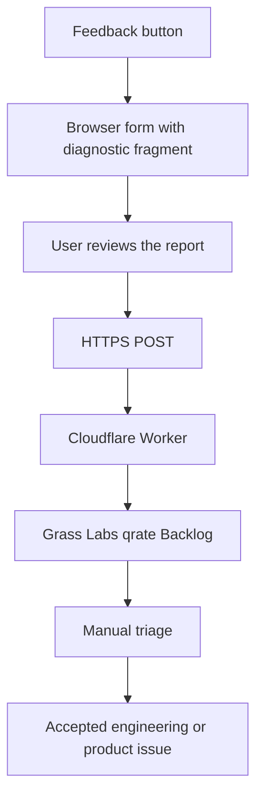

# In-app feedback reporting options

## Decision summary

Use a hosted feedback form and send reports to a Cloudflare Worker. The Worker creates an issue in Grass Labs, project qrate, milestone Beta Intake & Stabilization, state Backlog.

Add a persistent **Feedback** button to the main title bar and launcher title bar. Keep **Help > Send Feedback** as a second entry point.

The app should open the browser form with a small diagnostic payload in the URL fragment. The form should remove the fragment after it reads the data.

This design keeps temporary form code out of the desktop app. It also keeps reports private and does not require a reporter account.

The beta does not depend on `qrate://`. Website-to-app attachment can follow later through the plugin branch's shared protocol handler.

Do not send diagnostics inside a `qrate://` link. Operating systems can expose protocol arguments in process lists and logs.

## Final implementation audit

- Keep one hosted form and one Worker submission endpoint.
- Store reports and attachments in Linear. Do not add Notion synchronization or a separate upload bucket.
- Keep only a structured, versioned summary in the URL fragment. Exclude raw logs, plugin error strings, and file paths.
- Treat the fragment as visible to browser extensions and page scripts, not as encrypted storage.
- Remove the fragment immediately. Do not load analytics on the feedback page.
- Let users review and edit diagnostics before submission. Logs and screenshots require explicit file selection.
- Use `ui_ux` consistently in desktop links, the form, and the Worker.
- Keep Turnstile, bounded input, rate limiting, and duplicate-submit protection. Do not require a spoofable client header.
- Use one description field with category-specific guidance, rather than six separate forms.
- Crash is a manual report category. Automatic crash uploads and session recording are out of scope.
- Keep provider credentials in Worker secrets. Deployment and a live submission need operator configuration and verification.

## Current qrate features

qrate already has these local support features:

- A current session log and one rotated session log.
- Panic messages and backtraces in the session log.
- App version, commit, operating system, hardware, project size, plugin status, and a short log tail.
- Home directory redaction.
- **Copy Debug Info**, **Open Logs Folder**, and **Report an Issue** actions.
- A GitHub issue link that lets the user review the report before submission.

The current workflow has four limits:

1. GitHub requires an account.
2. Issues in the public qrate repository are public.
3. One generic form handles all report types.
4. The app has no persistent feedback button or hosted report form.

The work on `feat/in-app-feedback` adds bug, feature, and UI/UX shortcuts to the complete hosted form. It also removes the project filename from the diagnostic summary.

## Recommended beta design



### Browser feedback form

The form should contain:

- Category: **Bug**, **UI / UX**, **Feature Request**, **Crash**, **Performance**, or **Improvement**.
- Summary.
- A type-specific description field.
- Optional contact email.
- An **Include diagnostics** checkbox. Select it by default for bugs and UI/UX issues.
- An expandable diagnostic preview.
- Optional screenshot or recording selection.
- A privacy notice and a required review checkbox.
- **Send feedback** and **Cancel** buttons.

The form should keep entered text after a failed request. A successful request should show a public receipt ID, not a private Linear URL.

### App-to-browser data transfer

Use a URL fragment such as:

```text
https://qrate.dvnl.work/feedback#qrate=<base64url-json>
```

Browsers do not send a URL fragment in the HTTP request. Page JavaScript can read the payload locally and then call `history.replaceState` to remove it.

Keep the payload small. Include only a structured diagnostic summary. Do not include logs in a URL.

The form can accept a full log through a normal file picker. This action requires a separate user choice.

The future `qrate://` handler works in the other direction. This is not a beta dependency:

```text
qrate://feedback/new?return=https%3A%2F%2Fqrate.dvnl.work%2Ffeedback
```

qrate must allowlist the return origin. It then opens the browser form with a new diagnostic fragment.

### Data contract

Send only fields from an explicit allowlist.

Send these report fields:

- Report category.
- Summary and description.
- Reproduction steps and expected result for bugs.
- Optional contact email.
- Submission time from the Worker.
- A random request ID for safe retries.

The default diagnostic summary can contain:

- qrate version and commit.
- Operating system version and architecture.
- CPU model and logical core count.
- Used and total memory.
- Project row and column counts.
- Plugin counts and load-failure counts, without plugin names or error messages.

Never add these fields automatically:

- Project name or path.
- Cell values, notes, or column names.
- Linked file paths or file contents.
- Google tokens or account details.
- Local user name or home directory.
- The complete current or previous session log.

Log files can contain workplace details and secrets. The browser must show diagnostic text for review and require an explicit choice for file attachments.

Screenshots must be optional. The window must tell users to check screenshots for collection data.

### Worker controls

The Worker should:

1. Accept only `POST` requests with JSON or bounded multipart data.
2. Reject unknown fields.
3. Limit text and attachment sizes.
4. Apply an IP-based rate limit.
5. Validate the Turnstile token and expected hostname and action.
6. Use the request ID as an idempotency key.
7. Keep the Linear token in a Worker secret.
8. Avoid logging request bodies.
9. Return a generic error without Linear details.

Do not require a custom client header. It provides no authentication for a public browser form.

The hosted form can use Cloudflare Turnstile. The Worker must validate the Turnstile token before it creates a Linear issue.

### Storage and privacy

Create all reports in the existing **Grass Labs** team and **qrate** project. Assign the active **Beta Intake & Stabilization** milestone.

New reports start in **Backlog**. Triage moves accepted reports to **Todo**.

The complete workflow is:

- **Backlog**: raw intake.
- **Todo**: accepted work.
- **In Progress**: active work.
- **In Review**: testing and verification.
- **Done**: shipped work.
- **Canceled**: invalid, obsolete, or rejected reports.
- **Duplicate**: redundant reports.

Every report gets the **Feedback**, **Needs Triage**, **Platform / OS**, and **App Version** labels. Add exactly one category label.

Add **Logs Attached** only after the Worker uploads a log through Linear private storage.

Do not add **Reproducible** during intake. A reviewer adds it after a successful reproduction.

The Worker can upload screenshots to Linear private storage. Linear provides a `fileUpload` mutation and a server-side upload flow.

After triage, remove Needs Triage and move accepted reports to Todo in the same project. Add Reproducible only after verification.

### Linear configuration

These IDs are public configuration values. Keep only the Linear API key in a Worker secret.

| Item | ID |
|---|---|
| Grass Labs team | `d14f1e07-93ce-4cfe-968c-c6372c6f58a6` |
| qrate project | `aa8cfc24-95f6-461e-aac4-46437d89459e` |
| Beta Intake & Stabilization milestone | `7cdb86ec-c9a9-4d58-b46b-2e382566f1f5` |
| Backlog state | `4b7df4af-a498-4656-8d0a-c87e1c1d28aa` |
| Todo state | `8509604b-9991-4692-8b85-a083e0445f59` |
| In Progress state | `2758444f-10ab-4e6b-a3a6-c13e5326aa23` |
| In Review state | `8560a37f-8749-466e-ba8f-b622795ba3d4` |
| Done state | `ebed7fcf-e471-42c4-8d68-00c93ac41c4a` |
| Canceled state | `671784d6-b381-4624-9cc6-71dc96fecc73` |
| Duplicate state | `f0973e0d-201f-4904-bc49-bcb1cb0204dc` |
| Feedback label | `9caf21d4-082c-4a89-955e-981e850b6405` |
| Needs Triage label | `88dcf4fa-6ccd-4d48-b427-d6d190745e05` |
| Reproducible label | `d721d1ca-6213-4bda-8928-21ca37671d96` |
| Bug label | `9c1c54ef-3835-4b07-b7fe-c02952216f74` |
| UI / UX label | `8ac21715-4a1e-4a00-a4bb-06276a4ff7ca` |
| Crash label | `ed742751-05de-42db-a428-e52864a8a907` |
| Performance label | `154aeee1-f247-4bc6-b797-3b06051f1a7b` |
| Improvement label | `486d0f47-7520-42d5-88a5-c1fde5dcf769` |
| Logs Attached label | `0429eef3-39f3-4f67-a303-a9f985122a61` |
| Platform / OS label | `26451746-50ca-453e-840e-e8ed9c5a6fb7` |
| App Version label | `a47da0e4-5ef6-4a40-98ec-2ee8dcdcea20` |
| Feature Request label | `bf455f57-e866-46ae-8a73-5dcdd4f1cb23` |

Configure these values as Worker variables. Configure `LINEAR_API_KEY` with `wrangler secret put LINEAR_API_KEY`.

The issue creation mutation must set `teamId`, `projectId`, `projectMilestoneId`, `stateId`, and `labelIds`. The Worker should reject a successful HTTP response that contains GraphQL errors.

The Worker category mapping is:

| Form value | Linear label |
|---|---|
| `bug` | Bug |
| `ui_ux` | UI / UX |
| `feature` | Feature Request |
| `crash` | Crash |
| `performance` | Performance |
| `improvement` | Improvement |

Reject unknown categories instead of creating an issue without a category.

### Feedback Dashboard

Linear does not let the Worker create a saved custom view. Create **Feedback Dashboard** in the Linear UI with these filters:

- Project is **qrate**.
- Milestone is **Beta Intake & Stabilization**.
- State is **Backlog**, **Todo**, **In Progress**, or **In Review**.
- Label is **Feedback** or **Needs Triage**.

This view shows active intake and accepted work. It excludes shipped, canceled, and duplicate reports.

Update the website privacy policy before release. It currently states that qrate sends no reports and operates no data server.

The policy must name:

- The exact report data.
- Cloudflare and Linear as processors.
- The purpose of collection.
- The retention period.
- The deletion contact.
- The fact that submission is optional.

## Options

| Option | Beta effort | Reporter account | Privacy | Attachments | Tracker fit | Result |
|---|---:|---|---|---|---|---|
| Prefilled public GitHub issue | 1 day | GitHub required | Poor for workplace logs | Yes | Direct GitHub issue | Keep as fallback |
| Browser form, Worker, Linear | 3–5 days | None | Private with user preview | Yes | Separate feedback intake | **Recommended** |
| Browser form, Worker, Notion | 3–5 days | None | Private with user preview | Yes | Mixes raw feedback with planned work | Good alternative |
| Worker writes Notion and Linear | 5–7 days | None | Private with user preview | More complex | Creates duplicate state | Avoid |
| Email through the default mail app | 1–2 days | Email required | Depends on local email | Yes | Manual entry | Poor reliability |
| Sentry user feedback | 2–4 days | None | New external processor | Crash-focused | Separate tracker | Consider later for crashes |

### GitHub

GitHub issue forms support structured fields, labels, required answers, and file uploads. They still create issues in the target repository.

The public qrate repository cannot safely receive workplace logs by default. GitHub also adds an account requirement and takes users out of the app.

### Cloudflare Worker and Linear

The qrate website already runs on Cloudflare Workers. Static assets bypass the Worker, and the site already has one dynamic route.

The free Workers plan allows 100,000 requests each day. A feedback endpoint will use a very small part of that limit.

Linear supports issue creation through its GraphQL API. A restricted key can have issue creation access for one team.

Linear also supports private file storage through its server-side upload flow. This lets the Worker attach screenshots without a second storage service.

This pattern matches common product operations. Raw feedback goes to a separate intake queue. Reviewed work moves to the product or engineering backlog.

The separate team prevents unreviewed reports and spam from distorting planned work. It also gives the Worker token the smallest useful permission scope.

### Cloudflare Worker and Notion

Notion remains useful for planned product work and larger specifications. A separate feedback database could also hold raw reports.

This option offers flexible views and page content. It adds a promotion step before the team sees an issue in Linear.

Use Notion if the team wants research synthesis before engineering triage. Use Linear if the team wants one operational feedback queue.

### Sentry

Sentry can pair Rust error events with user comments. Its standard Rust feedback flow uses a JavaScript crash report modal.

Sentry fits automatic crash reporting better than feature requests or general UI/UX feedback. It also changes qrate from local logs to continuous third-party error collection.

Do not add Sentry for the beta feedback form. Review it as a separate opt-in crash reporting project.

## Minimal delivery plan

### Phase 1: browser intake

1. Add the persistent **Feedback** button.
2. Add the hosted form and six report categories on the `site` branch.
3. Open the form with an allowlisted diagnostic fragment.
4. Keep the existing GitHub action as a fallback.

### Phase 2: private delivery

1. Add the Worker endpoint on the `site` branch.
2. Add schema validation, Turnstile, size limits, rate limits, and idempotency.
3. Create reports in the separate Linear feedback team.
4. Upload screenshots through Linear after text reports work.
5. Update the privacy policy.

### Phase 3: beta operations

1. Add Linear views for new, accepted, and duplicate reports.
2. Define the retention and deletion process.
3. Test failures with no network and invalid server responses.
4. Test a packaged build on Windows, macOS, and Linux.

## External references

- [Cloudflare Workers pricing](https://developers.cloudflare.com/workers/platform/pricing/)
- [Cloudflare Workers rate limits](https://developers.cloudflare.com/workers/runtime-apis/bindings/rate-limit/)
- [Cloudflare Turnstile server validation](https://developers.cloudflare.com/turnstile/get-started/server-side-validation/)
- [Notion page creation](https://developers.notion.com/reference/post-page)
- [Notion API limits](https://developers.notion.com/reference/request-limits)
- [Notion file uploads](https://developers.notion.com/guides/data-apis/working-with-files-and-media)
- [Linear GraphQL API](https://linear.app/developers/graphql)
- [Linear API controls](https://linear.app/docs/api-and-webhooks)
- [Linear file uploads](https://linear.app/developers/how-to-upload-a-file-to-linear)
- [GitHub issue forms](https://docs.github.com/en/communities/using-templates-to-encourage-useful-issues-and-pull-requests/syntax-for-issue-forms)
- [Sentry feedback for Rust](https://docs.sentry.io/platforms/rust/user-feedback/)
